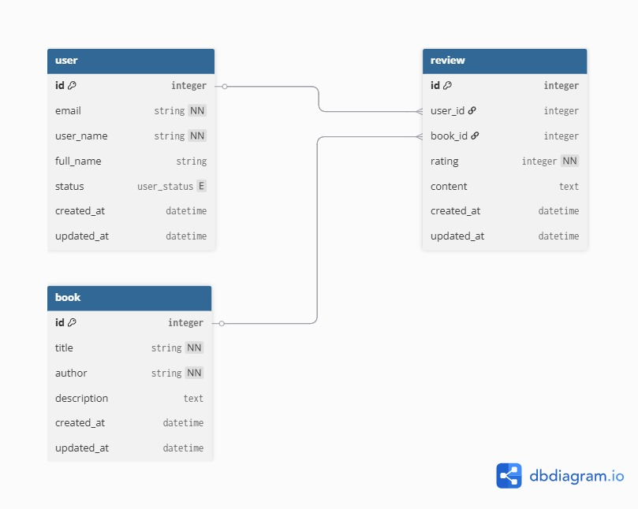
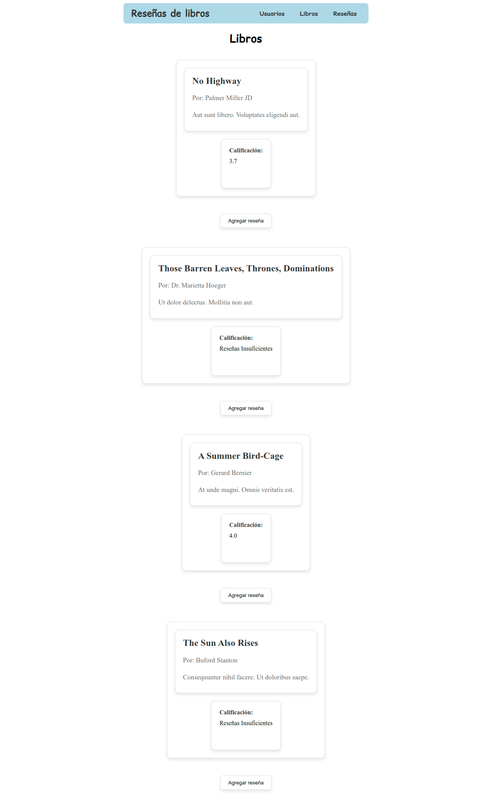
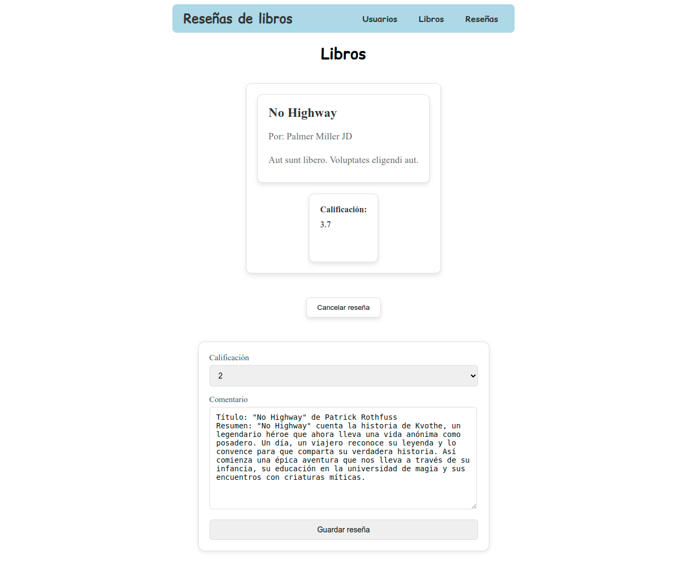
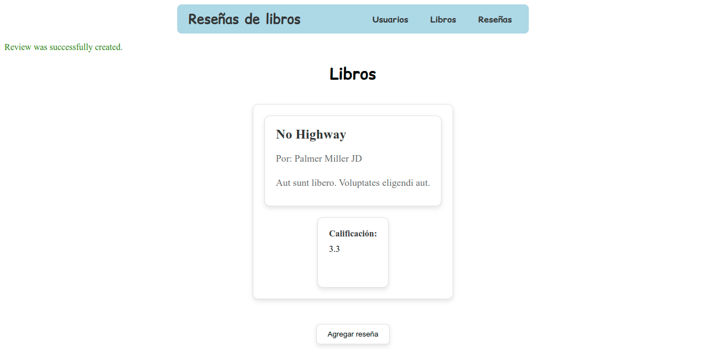
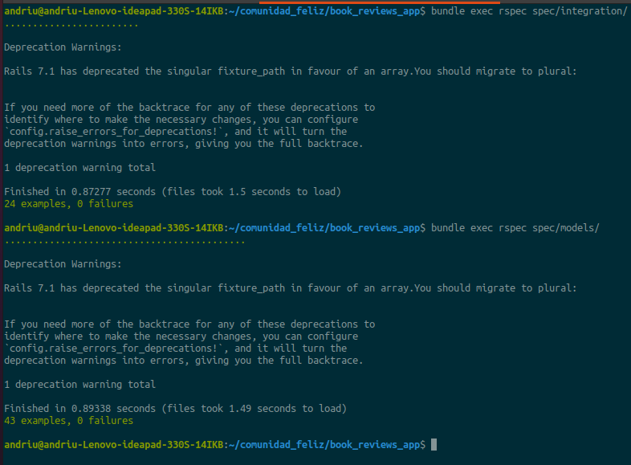

# 📚 Book Reviews — Rails App

> Aplicación para reseñas de libros, desarrollada con enfoque **TDD** usando **RSpec**. Incluye componentes de UI con **ViewComponent**, comportamiento con **Stimulus**, y  **docker** para facilitar la ejecución.

## Tabla de contenidos

* [Demo / Capturas](#demo--capturas)
* [Stack Tecnológico](#stack-tecnológico)
* [Requisitos](#requisitos)
* [Configuración local](#configuración-local)
* [Base de datos](#base-de-datos)
* [Ejecución de la app](#ejecución-de-la-app)
* [Pruebas (TDD con RSpec)](#pruebas-tdd-con-rspec)
* [Componentes de UI](#componentes-de-ui)
* [Docker](#docker)
* [Decisiones de diseño](#decisiones-de-diseño)
* [Contribuir](#contribuir)

---

## Demo / Capturas
* **Esquema de base de datos:**
  

* **Funcionamiento de la app:**
  * **Listado de libros:**
    
  * **Crear reseña:**
    
  * **Reseña actualizada:**
    

* **Pruebas en verde (RSpec):**
  

## Stack Tecnológico

* **Ruby:** `<3.2.2>`
* **Rails:** `<7.x>`
* **Base de datos:** `<PostgreSQL>`
* **Pruebas:** `RSpec`
* **Front:** `ViewComponent` + `Stimulus`
* **Contenedores:** `Docker` (`docker-compose`)

---

## Requisitos

* **Ruby** `<3.2.2>` (recomendado con `rbenv` o `asdf`)
* **Bundler** `gem install bundler`
* **Base de datos** `<PostgreSQL>` instalada y corriendo (para ejecución local sin Docker)

---

## Configuración local

```bash
git clone <url-del-repo>
cd <carpeta-del-repo>

rbenv install <3.2.2> -s
rbenv local <3.2.2>

bundle install

cp .env.example .env
USERNAME=
PASSWORD=
HOST=
```
---

## Base de datos

```bash
bin/rails db:create
bin/rails db:migrate
bin/rails db:seed
```
> Asegúrate de que `config/database.yml` apunte a tu base de datos y credenciales (o usa ENV vars).

---

## Ejecución de la app

```bash
bin/rails server
```
## Pruebas (TDD con RSpec)

```bash
bundle exec rspec
bundle exec rspec spec/models/book_spec.rb
bundle exec rspec --format documentation
```
---

## Componentes de UI

* **ViewComponent**
  Ubicación: `app/components/`

  * `BookCardComponent` — muestra información resumida del libro.
  * `ReviewFormComponent` — formulario de reseñas.

* **Stimulus**
  Ubicación: `app/javascript/controllers/`

  * `rating_controller.js` — controla la interacción de puntuaciones (ej.: estrellas).

---
## Docker

### Opción A — Docker simple

**Dockerfile** (ejemplo mínimo):

**docker-compose.yml** (ejemplo):

```yaml
services:
  db:
    image: postgres
    environment:
      POSTGRES_USER: postgres
      POSTGRES_PASSWORD: postgres
      POSTGRES_DB: book_reviews_development
    ports:
      - "5432:5432"
    volumes:
      - db-data:/var/lib/postgresql/data

  web:
    build: .
    command: bin/rails server -b 0.0.0.0 -p 3000
    ports:
      - "3000:3000"
    environment:
      DATABASE_URL: postgres://postgres:postgres@db:5432/book_reviews_development
      RAILS_ENV: development
    depends_on:
      - db
    volumes:
      - .:/app

volumes:
  db-data:
```

**Levantar entorno:**

```bash
docker compose up --build
docker compose exec web bin/rails db:prepare
```

**Pruebas en Docker:**

```bash
docker compose exec web bundle exec rspec
```
---

## Decisiones de diseño

* **TDD primero:** asegura diseño guiado por comportamiento y evita sobre-ingeniería.
* **ViewComponent:** separa y reutiliza UI; facilita testear vistas.
* **Stimulus:** JS mínimo y estructurado.
* **Refactor temprano:** archivo único de estilos para coherencia.
* **Docker:** entornos reproducibles para evaluación y CI.

---

## Contribuir

1. Haz un fork y crea una rama: `git checkout -b feature/mi-mejora`
2. Corre pruebas: `bundle exec rspec`
3. Abre un PR describiendo cambios y adjunta capturas si afectan UI.
